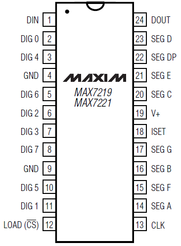
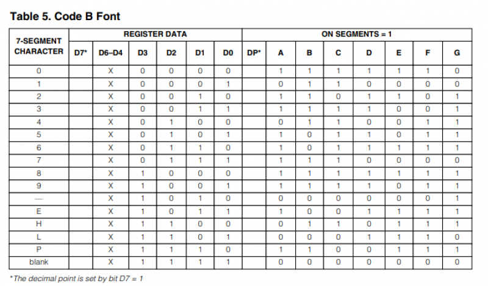

# MAX7219

Een 7-segment display aansturen met de MAX7219 is redelijk makkelijk. Er kunnen in totaal acht digits worden aangestuurd.

De complete [datasheet](https://datasheets.maximintegrated.com/en/ds/MAX7219-MAX7221.pdf datasheet) geeft alle informatie. Hieronder volgt een kort overzicht om snel mee aan de slag te kunnen.

## Serieel dataformaat (16-bits)

|D15|D14|D13|D12|D11|D10|D9|D8|D7|D6|D5|D4|D3|D2|D1|D0|
|---|---|---|---|---|---|--|--|--|--|--|--|--|--|--|--|
|X|X|X|X|ADDRESS|MSB DATA LSB||

## Register address map

|Register|D15-D12|D11|D10|D9|D8|Hex code|
|--------|-------|---|---|--|--|--------|
|No-Op  |X|0|0|0|0|0xX0|
|Digit 0|X|0|0|0|1|0xX1|
|Digit 1|X|0|0|1|0|0xX2|
|Digit 2|X|0|0|1|1|0xX3|
|Digit 3|X|0|1|0|0|0xX4|
|Digit 4|X|0|1|0|1|0xX5|
|Digit 5|X|0|1|1|0|0xX6|
|Digit 6|X|0|1|1|1|0xX7|
|Digit 7|X|1|0|0|0|0xX8|
|Decode Mode|X|1|0|0|1|0xX9|
|Intensity|X|1|0|1|0|0xXA|
|Scan limit|X|1|0|1|1|0xXB|
|Shutdown|X|1|1|0|0|0xXC|
|Display test|X|1|1|1|1|0xXF|

{{:public:xplane:screenshot_from_2020-03-21_21-41-55.png?800|}}

